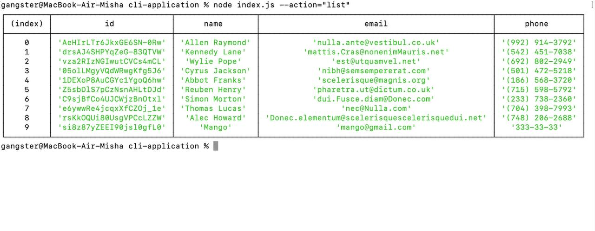
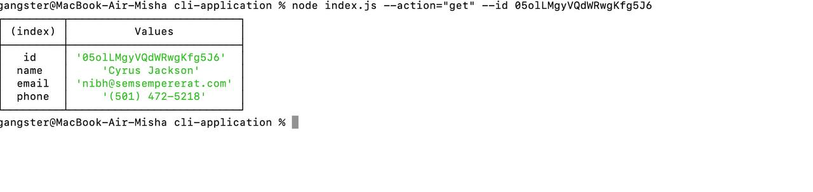
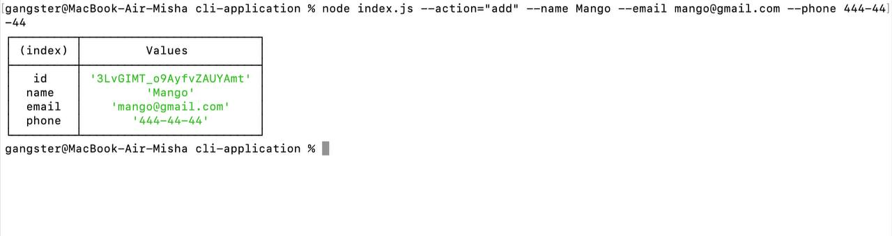
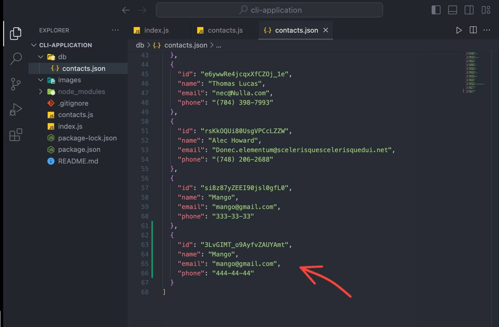
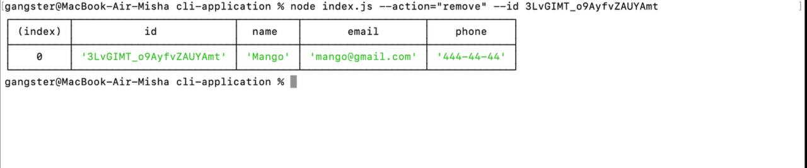

# Contacts Book CLI Application

## Installation

1. Clone the repo.
2. Run `npm install` command in your terminal/bash.
3. Then run `npm start` or `npm dev` command in your terminal/bash.

## Commands

1. Get and display the entire list of contacts in the form of a table (`console.table`): `node index.js --action list`

2. Get contact by id: `node index.js --action get --id 05olLMgyVQdWRwgKfg5J6`

3. Add the contact: `node index.js --action add --name Mango --email mango@gmail.com --phone 322-22-22`

4. Delete the contact: `node index.js --action remove --id 05olLMgyVQdWRwgKfg5J6`

## Usage

This CLI Contacts Book Application was created as a command line application for people who want to be able to view and manage their personal or business contact information, allowing them to organize and plan their personal/business life more efficiently.

The following screenshot demonstrates the application functionality:

- Run `node index.js --action list` to get the contacts list:

   

- Run `node index.js --action get --id 05olLMgyVQdWRwgKfg5J6` to get a contact by id:

   

- Run `node index.js --action add --name Mango --email mango@gmail.com --phone 322-22-22` to add a new contact:

   

   After the previous step, you will have a new contact in your JSON file:

   

- Run `node index.js --action remove --id 05olLMgyVQdWRwgKfg5J6` to remove a contact:

   

## Credits

This was a solo project completed by Mykhailo Shevchenko as homework for the GOIT FullStack Flex program.
